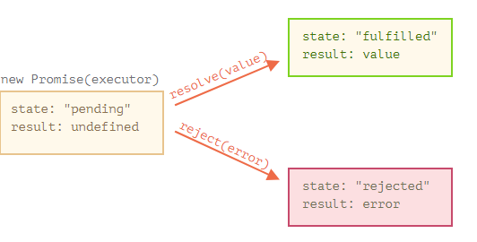

# Асинхронне виконання коду, проміси, бібліотека bluebird

Асинхронне виконання коду та асинхронне програмування в цілому є дуже важливим аспектом у написанні різних веб застосунків, як front-end так і back-end частини. Тож вивчення мови JavaScript(як нативного JS так і Node.js) не обходиться без вивчення базових концепцій асинхронного програмування.

## Для чого потрібне асинхронне програмування

Як правило, асинхронне програмування потрібне для підвищення швидкості роботи нашого коду, що має справу з I/O задачами(робота з файлами, запити в мережу або до БД та багато іншого), а також для покращення відгуку программи на дії користувача. Традиційно синхронне виконання коду є поступовим та відбувається зверху до низу при цьому код на 2 рядку не виконається раніше ніж на 1. Кожна операція очікує завершення попередньої, скільки б часу вона не зайняла. Асинхронне виконання коду дозволяє нам не чекати поки якась операція завершиться, а перейти до виконання наступної і потім, по готовності, завершити покинуту операцію.

*Синхронність vs Асинхронність в житті*

Задача: приготувати сніданок, чай з гарячими бутербродами

Синхронно:
1. Поставити чайник
2. Дочекатися кипіння і зробити чай
3. Дістати продукти та зробити бутерброди
4. Покласти бутерброди до мікрохвильовки
5. Дочекатися завершення та сісти снідати

Результат: поки ми займалися приготуванням бутербродів наш чай охолов.

Асинхронно: 
1. Поставаити чайник
2. Дістати продукти та зробити бутерброди
3. Покласти бутерброди до мікрохвильовки
4. Зробити чай
5. Вийняти бутерброди та сісти снідати

Результат: насолоджуємося теплим чаєм та гарячими бутербродами.

В силу нашої раціональності, навряд чи хтось готував би сніданок першим способом. *Проте, що важливо в цьому прикладі?* А важливо те, що ми мали змогу примінити асинхронний підхід за рахунок операцій, що вимагають очікування, адже в момент очікування закипання чайнику ми нічого не робимо, тому чого б не використати цей час по максимуму. Так і в програмуванні, замість того, щоб очікувати завершення відправленого запиту до мережі ми можемо відправити наступний запит, або обробити якісь інші події. 

Хтось міг подумати, що ми можемо таким чином прискорити будь-який код. Якщо ви збираєтесь покращувати швидкість виконання задач, що вимагають **математичних обчислень, сортування та пошуку даних, обробки зображень - словом, це CPU bound задачи**, то ви мусите знати, що **асинхронність нічим тут не допоможе**. Більш того, час виконання збільшиться.

 ---

## Асинхронне програмування в JavaScript

В JavaScript з асинхронністю ситуація така: вона присутня за замовчуванням. Код, що містить так звані "асинхронні операції" буде виконуватися асинхронно. Асинхронними операціями можна вважати ті, що створюють затримку, але не блокують виконання программи. З найпростіших можна навести методи `setTimeout()`, `setInterval()`.  


```js
console.log('Hi,')

setTimeout(function() {
    console.log('John.')
}, 2000)

console.log('my name is')
```

`setTimeout(func, timeout)` приймає в себе 2 аргументи, перший - функцію, що має виконатись після завершення timeout, а другий, безпосередньо, сам timeout у мілісекундах.

**Вивід:**
```
Hi,
my name is
John.
```

В данному випадку виводиться спочатку "Hi," далі обробник фіксує `setTimeout()` створює затримку у 2 секунди та продовжує йти по коду, після цього виводиться "my name is", а вже по закінченню затримки виведеться вміст лямбда-функції "John.". 

### Як реалізована асинхронність в JavaScript

Тепер, коли приблизно зрозуміло як поводить себе JS в такому випадку, розберемо як це все відбувається "під капотом". А там ми маємо наступні механізми: Call Stack, Web APIs, Event Loop, Callback Queue. Виглядає це десь так:


*Розберемо покроково:*
* Крок №1 `console.log('Hi,')` потрапляє у Call Stack, виконується та прибирається звідти

* Крок №2 `setTimeout(callback, 5000)` потрапляє у Call Stack. Ця операція не є частиною JS движку, а це просто Web API, що під'єднане до середовища браузера

* Крок №3 Web API браузера бере на себе callback та запускає таймер на 5000 мс 

* Крок №4 `console.log('my name is')` потрапляє у Call Stack, виконується та прибирається звідти

* Крок №5 тепер у нас є callback у Web API, який спрацює через 5000 мс, але сам Web API не може закинути щось у Call Stack аби яким чином, адже це може перервати виконання іншого коду JS движком в даний момент. Так що, callback потрапить до Callback Queue по завершенню 5000 мс. А Web API тепер порожній.

* Крок №6 Event Loop бере перший елемент із Callback Queue та переміщує його до 
Call Stack тоді, коли Call Stack пустий та вільний, а на даному етапі він якраз пустий.

* Крок №7 callback знаходиться у Call Stack та виконується

* Крок №8 `console.log('John.')`, що знаходиться у полі зору callback, відправляється до Call Stack

* Крок №9 після виконання `console.log('John.')` викидається зі Call Stack. Тоді завершується callback і також викидається звідти.

---

## Асинхронне програмування на callback`ах

Перш ніж розглянути асинхронне програмування на промісах, було б добре зрозуміти один з основних підходів для написання асинхронного коду, те на чому базуються проміси - callback`ах. **Callback** - це функція зворотнього визову, яка передається в іншу функцію. Тобто, вона є функцією вищого порядку. Далеко не кожна функція, що приймає в себе callback є асинхронною.

**Приклад №1:**

Реалізуємо найпростішу асинхронну операцію за допомогою callback`у.
```js
function simpleDelay(callback) {
    setTimeout(function() {
        console.log('Actions after timeout...')
        callback()
    }, 2000)
}

console.log('Start')

simpleDelay(function() {
    console.log('Сallback-function actions...')
})

console.log('End')
```
Розберемо, що тут відбувається. Ми створюємо функцію `simpleDelay(callback)`, яка єдиним аргументом приймає у себе callback-функцію. У створеній функції ми використовуємо асинхронну операцію `setTimeout()`, де ми маємо виконати певні дії у майбутньому, а саме: `console.log(...)` та виклик callback-функції `callback()`. Далі робимо синхронний виклик `console.log('Start')`, після чого викликаємо створену функцію та передаємо в неї callback `function() {...}`, що має вивести в консоль *"Callback-function actions..."*. Обробник переключається на останній рядок `console.log('End')` та виконує його. По завершенню таймауту виконається `console.log('Actions after timeout...')` і виклик callback`y, що далі виведе *"Сallback-function actions..."*. 

**Вивід:**
```
Start
End
Actions after timeout...
Сallback-function actions...
```
>Детально ви можете розглянути роботу Call Stack, Event Loop, Web APi та Callback Queue з вищенаведеним кодом [тут](https://www.google.com/url?sa=t&rct=j&q=&esrc=s&source=web&cd=&ved=2ahUKEwjz597WxenuAhXsmIsKHSXxALQQFjAAegQIARAC&url=http%3A%2F%2Flatentflip.com%2Floupe%2F&usg=AOvVaw1Qk8zKQbHSKvdOz8_eOc44).


### Використання аргументів разом з callback'ом у функціях вищого порядку 

Працючи з функіями, які приймають callback, ми також можемо передавати до них аргументи. Для уникнення непорозумінь та помилок з приводу що, коли і в якій послідовності передавати, прийнято передавати спочатку аргументи до функції, і в останню вже чергу callback. Ось таким чином:

 `function someFunction(arg1, arg2, arg3, callback) {...}`

 При цьому, саму функцію зворотнього виклику не обов'язково називати "callback", але рахується гарним тоном явно вказувати, що даний аргумент є callback`ом. Також скорочено використовують "cb" замість "callback". 

 ### Опрацювання помилок у callback'ax

Під час виконання асинхроних операцій так само як і під час синхронних можуть виникати помилки. Для того, щоб якась ймовірна помилка не змусила "впасти" вашу программу її потрібно обробити. На такий випадок існує домовленість серед програмістів застосовувати підхід *"error-first-callback"* або ж "callback з першим аргументом помилкою". 

**Приклад №2:**

Імітуємо отримання даних від користувача - в рамках прикладу це буде генерація випадкового числа від 0 до 1. За допомогою `setTimeout()` робимо вигляд, що це займає певний час. Умовою вдалого виконання будемо вважати "ввід користувача" більший за 0.5, якщо ж число менше, то відбувається помилка.
```js
function generateNumber(callback) {
    setTimeout(function() {
        const number = Math.random()
        console.log(`User's input is ${number}`)
        if (number > 0.5) {
            callback(null, number)
        } else {
            callback(new Error('Incorrect input: number is lower than 0.5!'))
        }
    }, 1500)
}

generateNumber(function(err, res) {
    if (err) {
        throw err
    } else {
        console.log(`Result ${res} is correct`)
    }
})
```
Організація такої імітації доволі проста. У тілі анонімної функції, що передається в `setTimeout()` ми генеруємо випадкове число, виводимо його у консоль та перевіряємо чи задовольняє воно нашу умову, якщо так, то ми передаємо у виклиці callback'у першим аргументом *null*, а другим згенерований результат `callback(null, number)`. Якщо перестрибнути на виклик `generateNumber()`, то ми бачимо, що в ролі callback'y ми передаємо анонімну функцію, яка приймає першим аргументом помилку *err*, а другим результат вдалого виконання *res*. Оскільки ми запустили `callback(null, number)`, то в `if (err) {...}` потрапив *null*, тобто помилки не сталося і ми потрапляємо в `else{...}` та робимо відповідний вивід у консоль, де наш *res* це є наш *number* переданий раніше. З іншої сторони, якщо ми викликаємо `callback(new Error(...))` з єдиним аргументом помилкою, то при виклиці `generateNumber()` ми попадемо в `if (err) {...}` та здійснимо `throw err`. Ось і все.

1. **Вивід без помилки:**
```
User's input is 0.7936847009858006
Result 0.7936847009858006 is correct
```
2. **Вивід з помилкою:**
```
        throw err
        ^

Error: Incorrect input: number is lower than 0.5!
```

### Callback обернений в callback

Асинхронне виконання коду не обмежується визовом одного callback'y для кожного випадку, який оптимізує всю вашу низку операцій. Тому буває, що існує проблема коли користувач вводить декілька разіва якісь певні дані, а нам потрібно обробляти їх в залежності від того, що ми отримуємо на кожному кроці. Виходить, що асинхронне програмування займається безпосередньо задачею синхронізації якихось певних операцій. До прикладу, операція "Б" не може коректно виконуватись, поки не виконана операція "A". Адже дані, що ми отримаємо на виконання у операцію "Б" можуть бути як не повноцінними, так і не мати певного типу(мова про undefined) взагалі, якщо операція "Б" не дочекається завершення операції "A".

**Приклад №3:**

Будемо зчитувати дані з файлу та обробляти їх, коли вони будуть готові. Стовримо дві функції, одна буде зчитувати дані з файлу, а друга імітувати довгу обробку.
Суть в тому, що функція `processData()` повинна дочекатися даних з функції `getDataFromFile()`. Якщо написати такий код синхронно, то результатом буде *NaN*. Приклад такого коду можна знайти в цьому репозиторії. Найпростіше, що можна зробити - це покласти виклик функції `processData()` у гілку `else {...}` виклику `getDataFromFile()`. Тоді, ми зможемо дочекатись завершення зчитування даних і благополучно передати результат в наступну функцію обробник.

>*Примітка: код, що буде далі написаний з використанням arrow functions для економії місця*

```js
const fs = require('fs')

function getDataFromFile(path, callback) {
    fs.readFile(path, 'utf-8', (err, content) => {
        if (err) {
            callback(new Error('Oops...'))
        } 
        callback(null, +content)
    })
}

function processData(number, callback) {
    setTimeout(() => {
        const number2 = 50
        callback(null, number+number2)
    }, 1500)
}

getDataFromFile('./txt/test.txt', (err, res) => {
    if (err) {
        throw err
    } else {
        console.log(`Data in file: ${res}`)
        processData(res, (err2, res2) => {
            if (err2) {
                throw err2
            } else {
                console.log(`Processed data: ${res2}`)
            }
        })
    }
})
```
**Вивід:**
```
Data in file: 120
Processed data: 170
```

 Проте, виглядає така конструкція сумнівно... А що, якщо наш ланцюжок асинхронних операцій більший? Кожен раз вкладати виклик нової функції з callback'ом у конструкцію `else {...}` попередньої функції? В такому разі ми отримаємо те, що називається **"Callback Hell"** або ж **"Пекельна піраміда викликів"**. 

 **Приклад №4:**
 ```js
 function simpleDelay(arg, callback) {
    setTimeout(() => {
        arg ++
        callback(null, arg)
    }, 1000)
}

simpleDelay(0, (err, res) => {
    if (err) {
        throw err
    } else {
        console.log(res)
        simpleDelay(res, (err2, res2) => {
            if (err2) {
                throw err2
            } else {
                console.log(res2)
                simpleDelay(res2, (err3, res3) => {
                    if (err3) {
                        throw err3
                    } else {
                        console.log(res3)
                        simpleDelay(res3, (err4, res4) => {
                            if (err4) {
                                throw err4
                            } else {
                                console.log(res4)
                            }
                        })
                    }
                })
            }
        })
    }
})
 ```

 **Вивід:**

 ```
1
2
3
4
 ```
 Це коли з кожним нашим викликом ми збільшуємо рівень вкладеності коду. Зрозуміло, що такий код неможливо читати та в ньому дуже легко заплутатись. 
Є принаймні 2 шляхи вирішення такої проблеми. Перший це ізолювати кожну дію в окрему функцію. Розглядати ми його не будемо. В результаті вкладеність зменшується, проте код виглядає "розірваним", таке не зручно читати. Другий же шлях це використовувати проміси, про що ми далі і будемо говорити.

---

## Асинхронне програмування на промісах

**Проміси** або ж **Promise** - (від англ. promise - обіцянка) це механізм, в основі якого лежать callback'и, що дозволяє нам позбавитися від вкладеності коду та перейти до зручного опрацювання асинхронних операцій. Також дозволяє створення послідовнго ланцюжку асинхронних операцій, що є більш читабельним та логічним. Promise є об'єктом JavaScript, який допомагає нам зв'язувати код, що займається виконанням асинхронних операцій та подальшим переданням отриманих даних і код, що безпосередньо "споживає" те, що "продукує" перший. Наче дві функії, одна з яких дістає дані звідкись, а інша очікує та приймає їх. 

Для створення промісу ми використовуємо конструкцію ось таку конструкцію:  
```js
new Promise(function(resolve, reject) {
    // async actions
    //... 
    resolve(value)
    reject(new Error('...'))
})
```
де *resolve* та *reject* є вбудованими callback-функціями. У тілі функції, що ми передали, виконується "продукуючий" код, тобто асинхронні операції. Тоді, в залежності від того чи успішно виконалася операція ми викликаємо наші callback`и: 
* `resolve(value)` - сповіщає про успішне виконання промісу, сама функція відповідає за повернення успішного результату. Замість *value* можна нічого не предавати

* `reject(new Error('...'))` - сповіщає про помилку під час виконання. Обов'язково треба передати об'єкт `new Error(')`

###  Властивості промісів

Об'єкт Promise має дві властивості: *state* та *result*. Перший, тобто *state*, відповідає за стан об'єкту - при створенні він має стан *pending* (очікуваня) після виклику `resolve(value)` - *fulfilled* (виконано успішно), а після виклику `reject(err)` - *rejected*(виконано з помилкою). Другий, *result* - при створенні *undefined*, після виклику `resolve(value)` - *value*, а після виклику `reject(error)` - *error*.



**Приклад №5:**

Перепишемо нашу функцію `simpleDelay()`, що розлядалась ще на початку, але вже з використанням промісів. 
```js
function newSimpleDelay() {
    return new Promise(resolve => {
        setTimeout(() => {
            console.log('Actions after timeout...')
            resolve()
        }, 2000)
    })
}
newSimpleDelay()
```

**Вивід:**

```
Actions after timeout...
```
Перепишемо функцію так, щоб вона повертала помилку, після закінчення таймауту. Тепер, коли ми задаємо в функії `newSimpleDelay()` значення більше ніж 2000 мс, то отримуємо помилку.

**Приклад №6:**

```js
function newSimpleDelay(time) {
    return new Promise((resolve, reject) => {
        setTimeout(() => {
            console.log('Actions after timeout...')
            if (time > 2000) {
                reject(new Error('We can`t wait so long!'))
            } else {
                resolve()
            }
            
        }, time)
    })
}
newSimpleDelay(3000)
```
**Вивід:**
```
            reject(new Error('We can`t wait so long!'))
                    ^
Error: We can`t wait so long!
```

### Обробка результатів та помилок у промісах: then, catch, finally

Тепер було б добре обробляти те, що ми отримали від промісу. На щастя, це досить просто зробити, адже у об'єкту Promise є методи на цей випадок:
* `.then(function(res) {}, function(err) {})` - допомагає обробляти результати та помилки. В першій функції обробляються успішні результати, а в другій помилки. Другу функію можна не використовувати.

* `.catch(function(err) {})` - використовується для обробки помилок замість другої функції в `.then()`. 

* `.finally(function() {})` - використовується для виконання певних дій незалежно від того як завершився проміс, тобто виконається в будь-якому випадку по аналогії з *finally* із `try{} catch{} finally{}`.

**Приклад №7:**

`.then()` без обробки помилок, та з нею.
```js
function newSimpleDelay(time) {
    return new Promise((resolve, reject) => {
        setTimeout(() => {
            console.log('Actions after timeout...')
            if (time > 2000) {
                reject(new Error('We can`t wait so long!'))
            } else {
                resolve(time)
            }
            
        }, time)
    })
}

newSimpleDelay(2000).then(res => console.log(res))
newSimpleDelay(3000).then(res => console.log(res), err => console.error(err))
```
**Вивід:**

```
Actions after timeout...
2000
Actions after timeout...
Error: We can`t wait so long!
```

> Далі використовується все та ж сама вищеописана функція `newSimpleDelay()`

**Приклад №8:**

`.catch()`
```js
newSimpleDelay(3000).catch(err => console.error(err))
```

**Вивід:**

```
Actions after timeout...
Error: We can`t wait so long!
```

**Приклад №9:**

`.finally()`
```js
newSimpleDelay(2000).finally(() => console.log('End of the first promise'))
newSimpleDelay(3000).finally(() => console.log('End of the second promise'))
```

**Вивід:**

```
Actions after timeout...
End of the first promise
Actions after timeout...
End of the second promise

           reject(new Error('We can`t wait so long!'))
                       ^

Error: We can`t wait so long!
```

### Ланцюжок промісів

Методи об'єкту Promise `.then()`, `.catch()`, `.finally()` можна викликати один за одним.

**Приклад №10:**

На кожен виклик `.then(res => newSimpleDelay(...))` ми повертаємо проміс з резултатом переданим у `resolve()`, в нашому випадку це *time*. Перший проміс виконається успішно та поверне проміс з результатом 2000 мс, далі ми передаємо результат у обробник `.then()` та зменшуємо його на 100 мс, в результаті проміс виконається успішно та поверне 1900, а от наступному обробнику дістався проміс який має повернути помилку, адже ми передаємо 2100 мс, що є більше ніж 2000 мс, тож викличеться `reject()`. Проте після нього стоїть обробник `.catch()`, що зловить цю помилку. Ну і в кінці відпрацює `.finally()`. 

> Коли ми маємо багато обробників, то зручно їх записувати у стовпчик, щоб не порушувати читабельність коду.
```js
newSimpleDelay(2000)
    .then(res => newSimpleDelay(res - 100))
    .then(res => newSimpleDelay(res + 200))
    .catch(err => console.error(err))
    .finally(() => console.log('End'))
```
**Вивід:**
```
Actions after timeout...
Actions after timeout...
Actions after timeout...
Error: We can`t wait so long!
End
```

Зручно завжди мати обробник `.catch()` в кінці, адже він може "виловити" помилку в будь-якому попередньому місці, тобто, `.catch()` ловитиме не тільки ту помилку, що виникла у попередньому обробнику. В цьому можна пересвідчитись, якщо створити помилку не в другому обробнику `.then()`, а в першому або ж взагалі у початковому промісі ще до всіх обробників. 

Також нам не обов'язково повертати саме проміс, щоб обробити його за допомогою `.then()`. Суть в тому, що жоден наш `.then()` обробник не виконує асинхронної операції, проте все ще чекає результату від попередньої операції.

**Приклад №11:**

```js
function simpleCounter(number) {
    return new Promise(resolve => {
        setTimeout(() => {
            resolve(number+1)
        }, 1000)
    })
}

simpleCounter(0)
    .then(res => {
        console.log(res)
        return res+1
    })
    .then(res => {
        console.log(res)
        return res+1
    })
    .then(res => {
        console.log(res)
        return res+1
    })
    .then(res => {
        console.log(res)
        return res+1
    })
    .then(res => {
        console.log(res)
    })
```

**Вивід:**

```
1
2
3
4
5
```

 ### Методи промісів 

 Є ще 2 методи, які хотілося б розглянути в рамках цієї частини. Це методи об'єкту Promise `.all()` та `.race()`. В обидва методи ми передаємо масив промісів на виконання, різниця лише в наступному:
 * `.all()` - повертає масив результатів, коли всі проміси завершаться

 **Приклад №12:**
 ```js
Promise.all([
    newSimpleDelay(1000),
    newSimpleDelay(1500),
    newSimpleDelay(2000)
    ])
    .then(res => console.log(`Result: ${res}.`))
 ```
**Вивід:**
```
Actions after timeout...
Actions after timeout...
Actions after timeout...
Result: 1000,1500,2000.
```
 * `.race()` - повертає результат промісу, який завершився швидше всіх
 
  **Приклад №13:**
 ```js
Promise.race([
    newSimpleDelay(1000),
    newSimpleDelay(1500),
    newSimpleDelay(2000)
    ])
    .then(res => console.log(`Result: ${res}.`))
 ```
**Вивід:**
```
Actions after timeout...
Result: 1000.
Actions after timeout...
Actions after timeout...
```
---

## Бібліотека bluebird: основні функції

Бібліотека [bluebird](http://bluebirdjs.com/docs/getting-started.html) була створена для того, щоб полегшити життя програмістам - bluebird надає власні проміси та методи, яких немає в нативній реалізації. До речі, bluebird працює швидше нативної реалізації. Що ж такого є в bluebird? Ми ознайомимось з основними методами, які частіше всього використовують.

```js
const Promise = require('bluebird') // використовуватимо саме цей проміс надалі
```

1. `Promise.promisify()` - приймає функію, що має callback та повертає проміс.

**Приклад №14:**
```js
const fs = require('fs')

const readFile = Promise.promisify(fs.readFile)
readFile('./txt/test.txt', 'utf-8')
    .then(res => console.log(res))
    .catch(err => console.error(err))
```
**Вивід:**
```
120
```
2. `Promise.promisifyAll()` - теж саме, що й попередня, але для всього модулю. Виклик функцій відбувається за модифікованою назвою, а саме: `.functionNameAsync()`, тобто ми додаємо суфікс *Async* в кінець методу.

**Приклад №15:**
```js
const fs = Promise.promisifyAll(require('fs'))

fs.readFileAsync('./txt/test.txt', 'utf-8')
    .then(res => console.log(res))
    .catch(err => console.error(err))

```
**Вивід:**
```
120
```
Також є можливість задати власний суфікс:
```js
const fs = Promise.promisifyAll(require('fs'), {suffix: "SomeSuffix"})

fs.readFileSomeSuffix('./txt/test.txt', 'utf-8')
```
3. `.spread()` - працює як `.then()` проте використовується, коли повертається масив промісів. Дозволяє розбити масив на окремі змінні, та звертатися безпосередньо до них.

**Приклад №16:**
```js
const fs = require('fs')
const myReadFile = Promise.promisify(fs.readFile)

Promise.all([
    myReadFile('./txt/test2.txt', 'utf-8'),
    myReadFile('./txt/test3.txt', 'utf-8'),
    myReadFile('./txt/test4.txt', 'utf-8')
])
    .spread((text2, text3, text4) => {
        console.log(`test2.txt: ${text2}`)
        console.log(`test3.txt: ${text3}`)
        console.log(`test4.txt: ${text4}`)
})
```
**Вивід:**
```
test2.txt: Text2
test3.txt: Text3
test4.txt: Text4
```
4. `.map()` - принцип роботи як і у звичайного *map*. Приймає масив даних, та функцію з асинхронною операцією

**Приклад №17:**
```js
const fs = require('fs')
const myReadFile = Promise.promisify(fs.readFile)
const filePaths = ['./txt/test2.txt', './txt/test3.txt', './txt/test4.txt']
Promise.map(filePaths, (path) => myReadFile(path, 'utf-8'))
    .then(() => console.log('Done!'))
```
**Вивід:**
```
Done!
```
Ще в `.map()` можна передати параметр *{concurrency: number}*, що дозволяє одночасно запускати *number* промісів. Корисно для відправлення лімітованої кількості запитів за раз. 

```js
Promise.map(filePaths, (path) => myReadFile(path, 'utf-8'), {concurrency:2})
    .then(() => console.log('Done!'))
```

Для виконання `.map()` з *{concurrency: 1}* існує окремий метод `.mapSeries()` .

5. `.any()` - дозволяє дочекатися завершення хоча б одного промісу із масиву. Проміс створенний даним методом перейде в стан *fulfilled* або *rejected*, коли хоча б один з елементів масиву промісів перейде в даний стан.

**Приклад №18:**
```js
const filePaths = ['./txt/test2.txt', './txt/test3.txt', './txt/test4.txt']
const promises = Promise.map(filePaths, (path) => myReadFile(path, 'utf-8'))
Promise.any(promises).then(res => console.log(res))
```
**Вивід:**
```
Text2
```
6. `.delay()` - дозволяє здійснити затримку перед тим як виконувати якусь асинхронну операцію, повертає проміс та передане значення.

**Приклад №19:**
```js
Promise.delay(1000)
    .then(() => {
        console.log('After 1 sec delay')
        return '1.5 sec later...'
    })
    .delay(500).then(res => console.log(res))
```
**Вивід:**
```
After 1 sec delay
1.5 sec later...
```
---

## Матеріал підготував 
* *студент групи ІВ-91 Черних Богдан* - [ForeverProglamer](https://github.com/ForeverProglamer)

><a href="https://github.com/ForeverProglamer/async-code-in-js" target="_blank">https://github.com/ForeverProglamer/async-code-in-js</a>